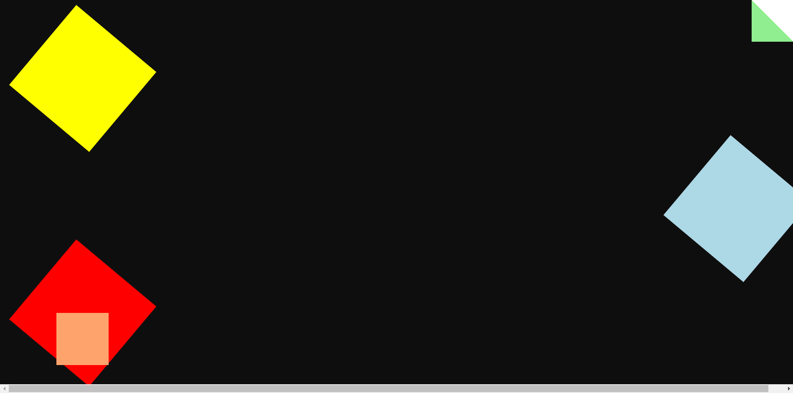

# skecht-box-animation
rotating colored box
A portfolio website template for campers

## Github repo

This is the [link](https://github.com/TimiBee/skecht-box-animation) 

**Client:** HTML, CSS, 

## Tools Used

Below are are list of tools used, and the precise things they were used for: to the Github repo of the project

## Folder Structure

The index.html and readme files are in the root folder, alongside the screenshot included in the readme.

## Customization Guide

The various sections in the HTML and CSS are well commented, so feel free to change whatever doesn't suit you need.

If you encounter problems customizing, reach out to me by sending me a DM on my [Twitter](https://www.twitter.com/Timi_Bee).

